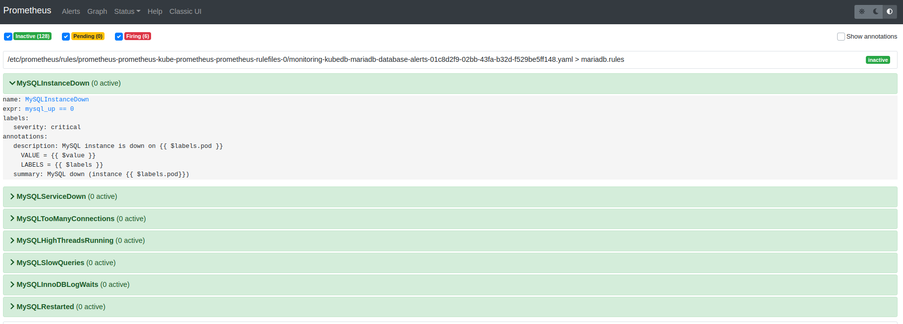

## MariaDB Alert Rules

### Database alerts

- **MySQLInstanceDown** - MySQL instance is down
- **MySQLServiceDown** - MySQL service is down (All db pods are down)
- **MySQLTooManyConnections** - MySQL too many connections (> 80%)
- **MySQLHighThreadsRunning** - MySQL high threads running (> 60%)
- **MySQLSlowQueries** - MySQL server mysql has some new slow query last minute
- **MySQLInnoDBLogWaits** - MySQL InnoDB log waits (> 10)
- **MySQLRestarted** - MySQL restarted last minute
- **MySQLHighQPS** - MySQL has high queries per second (> 1000)
- **MySQLHighIncomingBytes** -  MySQL has high incoming bytes second (> 1024 * 1024)
- **MySQLHighOutgoingBytes** -  MySQL has high outgoing bytes second (> 1024 * 1024)
- **MySQLTooManyOpenFiles** -  MySQL too many opened files (> 80%)

### Galera Cluster alerts

- **GaleraClusterReplicationLatencyTooLong** - MariaDB Galera Cluster latency too long ( > 100 ms)

### Summary alerts

- **KubeDBMariaDBPhaseNotReady** - KubeDB MariaDB Phase not ready
- **KubeDBMariaDBPhaseCritical** - KubeDB MariDB Phase Critical

### OpsRequest alerts

- **KubeDBMariaDBOpsRequestOnProgress** - MariaDBOpsRequest on progress
- **KubeDBMariaDBOpsRequestStatusProgressingToLong** - MariaDBOpsRequest is in progressing status for too long
- **KubeDBMariaDBOpsRequestFailed** - MariaDBOpsRequest failed

### Stash alerts

- **MariaDBStashBackupSessionFailed** -  MariaDB Stash restore session failed
- **MariaDBStashRestoreSessionFailed** - MariaDBOpsRequest is in progressing status for too long
- **MariaDBStashNoBackupSessionForTooLong** - MariaDB Stash no backup for last 5 hours
- **MariaDBStashRepositoryCorrupted** - MariaDB Stash repository corrupted
- **MariaDBStashRepositoryStorageRunningLow** - MariaDB Stash Repository storage > 10 GB
- **MariaDBStashBackupSessionPeriodTooLong** - MariaDB Stash backup session taking more than 30 minutes to complete
- **MariaDBStashRestoreSessionPeriodTooLong** - MariaDB Stash restore session taking more than 30 minutes to complete

### Demo

